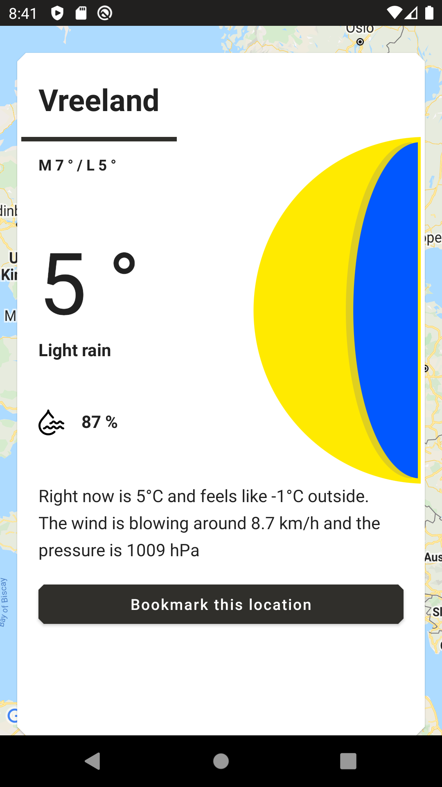
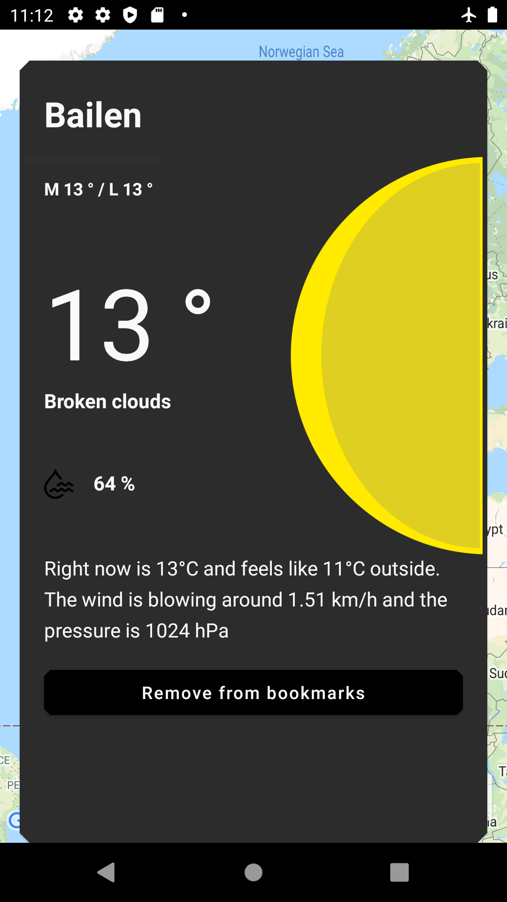
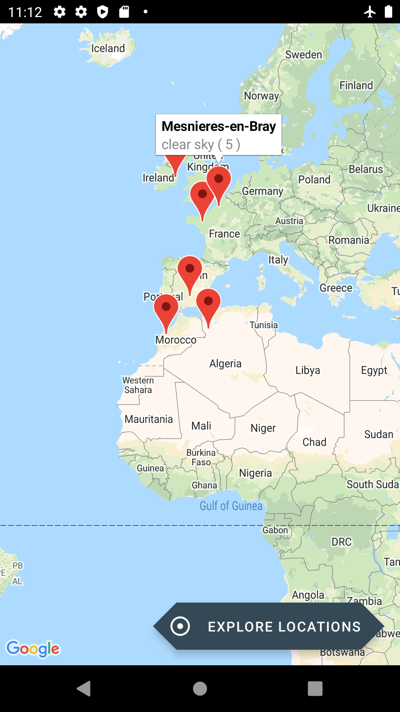
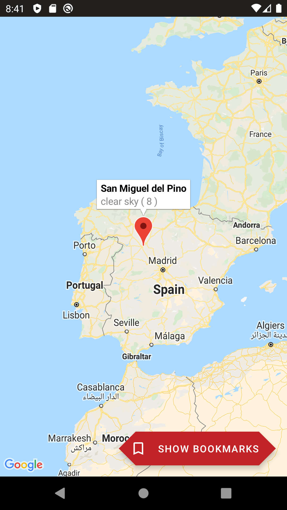

<h1 align="center">
  <a href="https://github.com/lucasmontano/openweathermap-react-native">
    
  </a>
</h1>

<h2 align="center">
  React Native OpenWeather App
</h2>

<p align="center">OpenWeather is a project created by Lucas Montano initially as an One-Day-Challange, then he decided to create an Open Source project to help his followers and everyone getting started with Open Source world building a basic but very strategic application!</p>

<p align="center">
  <a href="https://github.com/lucasmontano">
    
  </a>

  

  

  
</p>

<p align="center">
  
  
  
  
</p>

---

## Table of Contents

<ul>
  <li><a href="#-getting-started">Getting Started</a></li>
  <li><a href="#-features">Features</a></li>
  <li><a href="#-contributing">Contributing</a></li>
  <li><a href="#-support">Support</a></li>
  <li><a href="#-license">License</a></li>
  <li><a href="#-other-platforms">Other Platforms</a></li>
</ul>

---

## 🚀 Getting Started

### Prerequisites

- To run any React Native application you need to configure the environment on your machine.

- Setting the environment is a complex process, so it's recommended to follow the Rocketseat guide which is currently the most complete and detailed to make the settings:

#### [**Rocketseat Guide**](https://react-native.rocketseat.dev/)

### Clone

- Clone this repo to your local machine using:

```
https://github.com/lucasmontano/openweathermap-reactnative
```

### Setup

#### Android

- Configure the Google Maps API Key, follow the instructions in: https://developers.google.com/maps/documentation/android-sdk/get-api-key to generate a new api key.
- Rename the file 'android/local.properties.example' to 'android/local.properties' and change the string with your api key.

- `$ react-native run-android`

#### iOS - _MAC Only_

- `cd ios && pod install && cd ..`

- `react-native run-ios`

---

## 📋 Features

### Documentation

- [ ] Explore the Earth Weather forecast (Real Time)
- [ ] Check detailed information about the weather by coordinates (lat, lon)
- [ ] Bookmark a location
- [ ] Visualize all bookmarked locations in the map
- [ ] Remove a bookmark
- [ ] Data Cache
- [ ] Theme Switcher (Light/Dark Mode)
- [ ] One way data flow (implement a state reducer)
- [ ] Unique source of truth, implementing a centralized repository
- [ ] Search functionality
- [ ] Five+ days forecast
- [ ] Write some tests (of course)

### Build with

- Core
  - [React Native](https://reactnative.dev/) - A framework for building native apps with React
- Navigation
  - [React Navigation](https://reactnavigation.org/) - Routing and navigation for your React Native apps
- Debugging
  - [Reactotron](https://github.com/infinitered/reactotron) - Reactotron is a macOS, Windows, and Linux app for inspecting your React JS and React Native apps
- Styling
  - [Styled Components](https://styled-components.com/) - Use the best bits of ES6 and CSS to style your apps without stress
- HTTP Comunication
  - [Axios](https://github.com/axios/axios) - Promise based HTTP client for the browser and node.js
- Type Checking
  - [prop-types](https://github.com/facebook/prop-types) - Runtime type checking for React props and similar objects
- Linting
  - [ESLint](https://github.com/eslint/eslint) - Find and fix problems in your JavaScript code
  - [Prettier](https://prettier.io/) - Prettier is an opinionated code formatter
- Extra
  - [react-native-gesture-handler](https://github.com/software-mansion/react-native-gesture-handler) - Declarative API exposing platform native touch and gesture system to React Native
  - [babel-plugin-root-import](https://github.com/entwicklerstube/babel-plugin-root-import) - Babel plugin to add the opportunity to use import and require with root based paths
  - [eslint-config-airbnb](https://github.com/airbnb/javascript) - A mostly reasonable approach to JavaScript

---

## 🤔 Contributing

> To get started...

### Step 1

- 🍴 Fork this repo!

### Step 2

- 👯 Clone this repo to your local machine using `https://github.com/lucasmontano/openweathermap-reactnative.git`

### Step 3

- 🎋 Create your feature branch using `git checkout -b my-feature`

### Step 4

- ✅ Commit your changes using `git commit -m 'feat: My new feature'`;

### Step 5

- 📌 Push to the branch using `git push origin my-feature`;

### Step 6

- 🔃 Create a new pull request

After your Pull Request is merged, can you delete your feature branch.

---

## 📌 Support

Reach out to me at one of the following places!

- Twitter at [@lucas_montano](https://twitter.com/lucas_montano)
- Instagram at [@lucasmontano](https://www.instagram.com/lucasmontano/)
- Linkedin at [Lucas Montano](https://www.linkedin.com/in/lucasmontano/)
- Youtube at [Lucas Montano](https://www.youtube.com/lucasmontano)

---

## 📝 License


This project is licensed under the MIT License - see the [LICENSE](LICENSE) file for details.

---

## ⚒ Other Platforms

Open Weather on Other Platforms:

- Android: https://github.com/lucasmontano/openweathermap
- iOS: https://github.com/lucasmontano/openweathermap-ios
- Flutter: https://github.com/lucasmontano/openweathermap-flutter

---

Made with ♥ Enjoy it!
